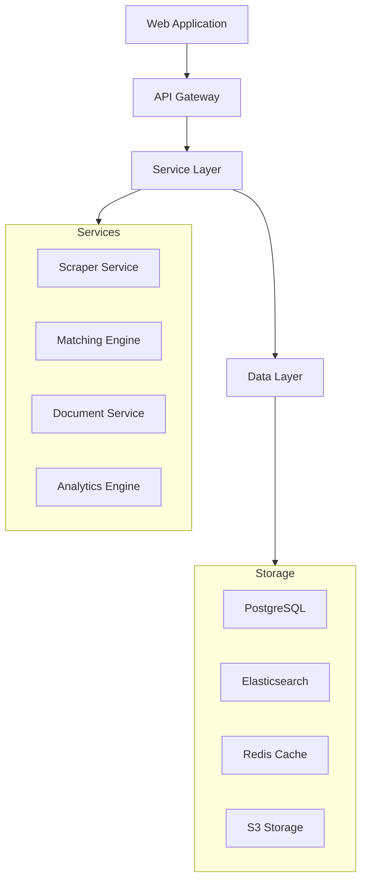

# Incepta - Technology Transfer & Grant Matching Platform

[](https://github.com/incepta/incepta/actions/workflows/backend-ci.yml)
[](https://github.com/incepta/incepta/actions/workflows/frontend-ci.yml)
[](https://github.com/incepta/incepta/actions/workflows/security-scan.yml)
[]

Incepta is a comprehensive technology transfer and grant matching platform that bridges the gap between academic innovations and commercial opportunities. Through automated data collection from 375+ technology transfer offices (TTOs) and AI-powered matching algorithms, we enable entrepreneurs to efficiently discover licensable technologies while securing non-dilutive funding.

## Features by Stakeholder

### Technology Transfer Offices (TTOs)
- Automated technology listing management
- Secure document sharing and messaging
- Analytics and reporting dashboard
- Licensing workflow automation
- Integration with university systems

### Entrepreneurs
- AI-powered technology matching
- Grant discovery and matching
- LLM-assisted grant writing
- Due diligence document management
- Progress tracking dashboard

### Researchers
- Research commercialization tools
- Publication and patent tracking
- Industry connection matching
- Funding opportunity alerts
- Impact metrics dashboard

### Accelerators
- Portfolio company management
- Technology scouting tools
- Grant program integration
- Performance analytics
- Partner network access

## System Architecture



## Technology Stack

| Component | Technology | Version |
|-----------|------------|----------|
| Frontend | React | 18.2.0 |
| API | Node.js | 18 LTS |
| Database | PostgreSQL | 15+ |
| Search | Elasticsearch | 8.9+ |
| Cache | Redis | 7.0+ |
| ML/AI | TensorFlow | 2.13+ |
| Container | Docker | 24+ |
| Infrastructure | AWS CDK | 2.0+ |

## Prerequisites

- Node.js 18 LTS with npm 9+
- Python 3.11+ with Poetry
- Docker 24+ and Docker Compose v2
- AWS CLI v2 with configured credentials
- Git 2.40+
- PostgreSQL 15+ client tools

### Hardware Requirements
- CPU: 4+ cores
- RAM: 16GB minimum
- Storage: 50GB+ available space
- Network: Reliable broadband connection

### Required Accounts
- AWS Account with appropriate IAM permissions
- GitHub account with repository access
- Docker Hub account for container registry
- OpenAI API key for LLM features

## Quick Start

```bash
# Clone repository
git clone git@github.com:incepta/incepta.git
cd incepta

# Configure environment
cp .env.example .env

# Start development environment
docker-compose up -d
npm run setup:dev
npm run verify:env
```

### Health Check
Visit http://localhost:3000 for the web interface and http://localhost:8000/health for API status.

## Project Structure

```
incepta/
├── src/
│   ├── web/                 # React frontend application
│   ├── backend/            # Node.js API services
│   ├── scraper/           # Python scraping services
│   └── ml/                # Machine learning services
├── infrastructure/        # AWS CDK infrastructure
├── scripts/              # Development and deployment scripts
├── tests/               # Test suites
└── docs/               # Documentation
```

## Development

### Environment Setup

```bash
# Backend setup
cd src/backend
poetry install
poetry run pre-commit install
poetry run pytest

# Frontend setup
cd ../web
npm install
npm run lint
npm run test
npm run dev
```

### Available Scripts

| Script | Purpose |
|--------|----------|
| `npm run dev` | Start development server |
| `npm run test` | Run test suites |
| `npm run lint` | Check code style |
| `npm run build` | Create production build |
| `npm run deploy` | Deploy to environment |

### Git Workflow
1. Create feature branch from `develop`
2. Implement changes with tests
3. Submit PR with description
4. Pass CI checks and review
5. Merge to `develop`
6. Release branches from `develop` to `main`

## Deployment

### Environment Configuration

| Environment | Purpose | Infrastructure |
|-------------|---------|----------------|
| Development | Feature development | Local Docker |
| Staging | Integration testing | AWS (us-east-1) |
| Production | Live system | AWS (us-east-1, us-west-2) |
| DR | Disaster recovery | AWS (eu-west-1) |

### Deployment Process

```bash
# Production build
npm run build:prod

# Infrastructure deployment
cd infrastructure
terraform init
terraform plan
terraform apply

# Application deployment
docker-compose -f docker-compose.prod.yml build
docker-compose -f docker-compose.prod.yml push
kubectl apply -f k8s/
```

## Documentation

- [API Documentation](./docs/api/README.md)
- [Architecture Decisions](./docs/architecture/README.md)
- [User Guides](./docs/guides/README.md)
- [Security Documentation](./docs/security/README.md)
- [Contributing Guidelines](./CONTRIBUTING.md)
- [License Information](./LICENSE)

## Support

- Technical Issues: Create a GitHub issue
- Security Concerns: security@incepta.com
- General Questions: support@incepta.com

## License

This project is proprietary software. See [LICENSE](./LICENSE) for details.

---

© 2024 Incepta. All rights reserved.