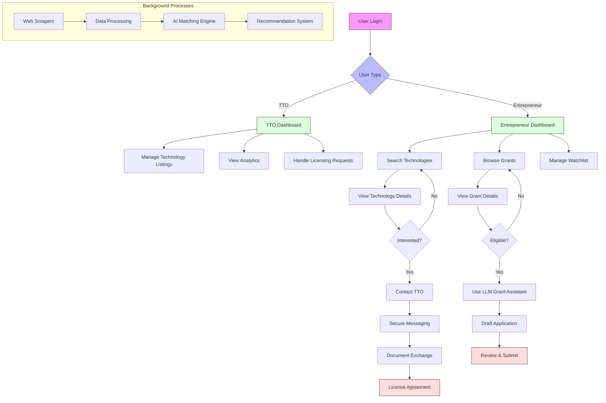
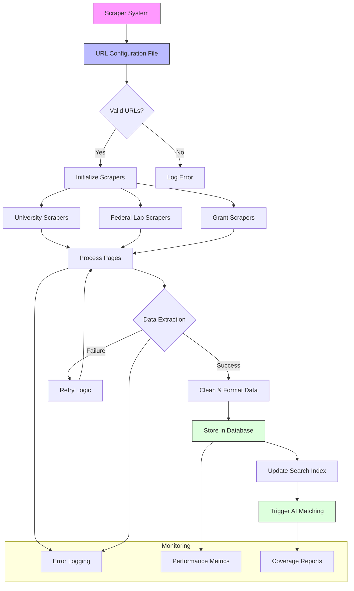
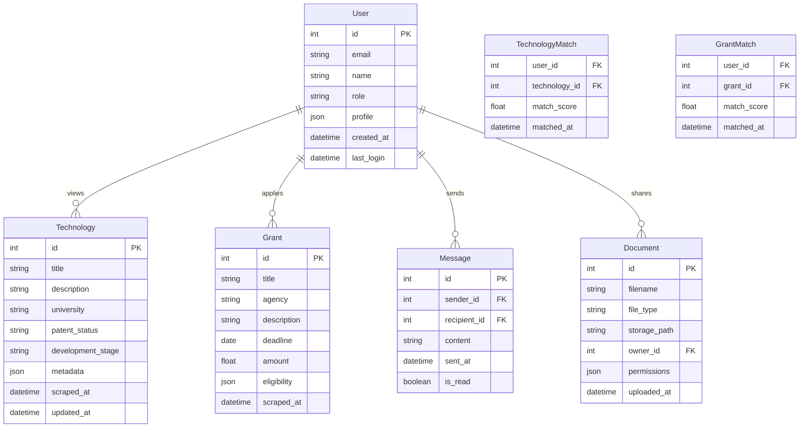
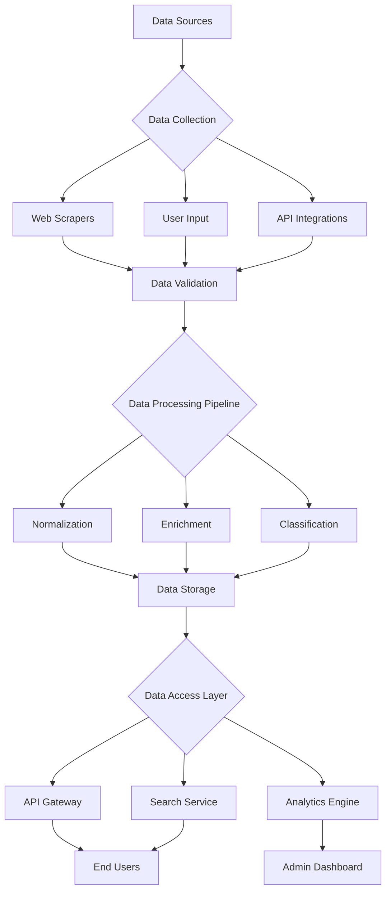
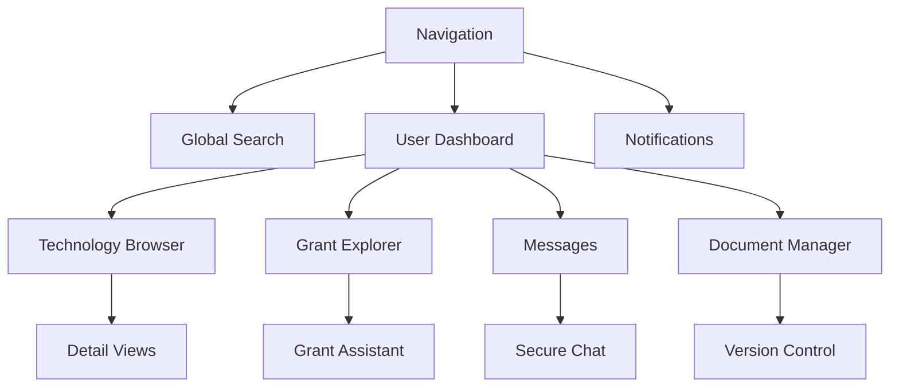
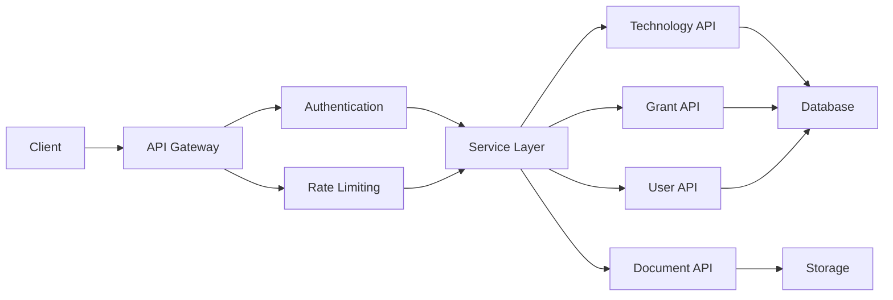

# Product Requirements Document (PRD)

## 1. INTRODUCTION

### 1.1 Purpose

This Product Requirements Document (PRD) specifies the requirements for Incepta, a technology transfer and grant matching platform. The document serves as a comprehensive reference for development teams, stakeholders, and project managers to ensure alignment on functionality, technical specifications, and implementation priorities. It provides detailed requirements for building a system that connects academic innovations with entrepreneurs while streamlining grant discovery and application processes.

### 1.2 Scope

Incepta is a web-based platform that will:

- Aggregate and maintain technology listings from 375+ university and federal lab technology transfer offices through automated scrapers
- Match entrepreneurs with licensable technologies based on their interests and expertise
- Facilitate secure communications and document sharing between TTOs and potential licensees
- Provide AI-powered grant matching and writing assistance
- Manage intellectual property workflows and licensing processes
- Generate analytics on technology transfer activities and outcomes

The platform will integrate:

- Web scrapers for continuous data collection from TTOs
- AI/ML models for matching and recommendations
- Secure messaging and file sharing capabilities
- Role-based access control
- Analytics and reporting tools
- LLM-powered grant writing assistance
- A payment platform

Out of scope:

- Legal services or representation
- Patent filing services
- Full grant management post-award
- General project management tools

The completed platform will serve as a centralized hub for technology transfer, dramatically improving the efficiency of commercializing academic research while helping founders access non-dilutive funding opportunities.

## 2. PRODUCT DESCRIPTION

### 2.1 Product Perspective

Incepta operates as a standalone web-based platform that integrates with multiple external systems:

- University and Federal Lab TTO websites via automated scrapers
- Grant databases and funding opportunity portals
- User authentication and identity verification services
- Cloud storage for secure document management
- AI/ML services for matching and recommendations
- LLM APIs for grant writing assistance

The system maintains its own databases while leveraging cloud infrastructure for scalability and reliability. All integrations use secure APIs and follow standard protocols for data exchange.

### 2.2 Product Functions

The platform provides these core functions:

- Automated technology listing aggregation from 375+ TTOs
- AI-powered matching between technologies and entrepreneurs
- Secure messaging and document sharing
- Grant opportunity discovery and matching
- LLM-assisted grant writing and templates
- IP workflow and licensing management
- Analytics dashboard and reporting
- Role-based access control and permissions
- Automated email notifications and alerts
- Saved searches and watchlists
- Technology and grant recommendation engine

### 2.3 User Characteristics

**Technology Transfer Officers (TTOs)**

- Technical expertise in IP management
- Familiar with licensing processes
- Need efficient ways to showcase technologies
- Regular platform usage for listing management

**Entrepreneurs/Founders**

- Various technical backgrounds
- Limited experience with tech transfer
- Seeking innovations to commercialize
- Frequent platform usage for discovery

**Academic Researchers**

- Deep subject matter expertise
- Limited business experience
- Occasional platform usage
- Focus on research impact

**Accelerator Managers**

- Business and startup expertise
- Support multiple portfolio companies
- Regular platform usage for scouting
- Need aggregate views and reports

### 2.4 Constraints

Technical Constraints:

- Must handle 100,000+ concurrent users
- 99.9% uptime requirement
- Sub-2 second response times
- End-to-end encryption for sensitive data
- Compliance with university IT security policies

Regulatory Constraints:

- GDPR and CCPA compliance required
- Export control regulations
- University IP policies
- Federal grant regulations

Business Constraints:

- Initial focus on US market
- Bootstrap funding model
- Limited initial development team
- 12-month timeline to MVP

### 2.5 Assumptions and Dependencies

Assumptions:

- Universities will allow automated scraping
- Entrepreneurs will value centralized access
- Grant databases maintain stable APIs
- LLM costs remain economically viable
- Users have modern web browsers

Dependencies:

- Reliable access to TTO websites
- Availability of AI/ML services
- Cloud infrastructure uptime
- Grant database API stability
- Identity verification services
- Document storage providers
- Email delivery services
- Payment processing systems

## 3. PROCESS FLOWCHART





## 4. FUNCTIONAL REQUIREMENTS

### 4.1 Technology Discovery & Matching

| ID | Description | Priority |
| --- | --- | --- |
| F1.1 | System must aggregate and maintain technology listings from 375+ university and federal lab TTOs through automated scrapers running biweekly | High |
| F1.2 | System must allow TTOs to manually add, edit, and manage technology listings including title, abstract, patents, and related metadata | High |
| F1.3 | System must provide AI-powered matching between technologies and entrepreneur profiles based on expertise and interests | High |
| F1.4 | System must enable advanced search with filters for technology domain, development stage, and licensing terms | Medium |
| F1.5 | System must generate and maintain watchlists for users to track technologies of interest | Medium |

### 4.2 Grant Discovery & Writing

| ID | Description | Priority |
| --- | --- | --- |
| F2.1 | System must aggregate grant opportunities from federal, state, and private funding sources through automated scrapers | High |
| F2.2 | System must match grant opportunities to technologies and startups based on eligibility criteria and focus areas | High |
| F2.3 | System must provide LLM-powered grant writing assistance with templates and suggestions | High |
| F2.4 | System must track grant deadlines and send automated reminders to users | Medium |
| F2.5 | System must maintain a database of successful grant applications as reference materials | Low |

### 4.3 Communication & Document Management

| ID | Description | Priority |
| --- | --- | --- |
| F3.1 | System must provide secure messaging between TTOs and potential licensees | High |
| F3.2 | System must enable encrypted document sharing and version control | High |
| F3.3 | System must maintain an audit trail of all communications and document exchanges | Medium |
| F3.4 | System must provide templated licensing agreements and term sheets | Medium |
| F3.5 | System must support electronic signatures for agreements | Low |

### 4.4 User Management & Security

| ID | Description | Priority |
| --- | --- | --- |
| F4.1 | System must implement role-based access control for TTOs, entrepreneurs, researchers, and administrators | High |
| F4.2 | System must verify user identities through multi-factor authentication | High |
| F4.3 | System must encrypt all sensitive data in transit and at rest | High |
| F4.4 | System must maintain detailed access logs for security auditing | Medium |
| F4.5 | System must allow users to manage their privacy settings and data sharing preferences | Medium |

### 4.5 Analytics & Reporting

| ID | Description | Priority |
| --- | --- | --- |
| F5.1 | System must track and report on technology listing engagement metrics | High |
| F5.2 | System must generate reports on licensing pipeline and conversion rates | High |
| F5.3 | System must provide analytics on grant success rates and funding outcomes | Medium |
| F5.4 | System must offer customizable dashboards for different user roles | Medium |
| F5.5 | System must enable export of reports in multiple formats (CSV, PDF, Excel) | Low |

### 4.6 Integration & Data Management

| ID | Description | Priority |
| --- | --- | --- |
| F6.1 | System must maintain an extensible URL configuration file for managing scraper targets | High |
| F6.2 | System must process and standardize data from multiple source formats | High |
| F6.3 | System must provide API endpoints for potential future integrations | Medium |
| F6.4 | System must implement automated data quality checks and validation | Medium |
| F6.5 | System must maintain data backups with point-in-time recovery capability | Medium |

## 5. NON-FUNCTIONAL REQUIREMENTS

### 5.1 Performance Requirements

| ID | Requirement | Target Metric |
| --- | --- | --- |
| P1 | Page load time | \< 2 seconds for 95% of requests |
| P2 | Search query response time | \< 1 second for 90% of queries |
| P3 | Concurrent users supported | 100,000+ |
| P4 | Database query performance | \< 500ms for 99% of queries |
| P5 | API response time | \< 1 second for 95% of calls |
| P6 | File upload/download speed | \> 10MB/s |
| P7 | Scraper completion time | \< 24 hours for full refresh cycle |
| P8 | LLM response time | \< 5 seconds for grant writing assistance |

### 5.2 Safety Requirements

| ID | Requirement | Description |
| --- | --- | --- |
| S1 | Data backup | Automated daily backups with 30-day retention |
| S2 | Disaster recovery | Recovery time objective (RTO) \< 4 hours |
| S3 | System monitoring | Real-time monitoring with automated alerts |
| S4 | Failover capability | Automatic failover to backup systems |
| S5 | Data validation | Input validation for all user-submitted data |
| S6 | Error handling | Graceful degradation of services during failures |
| S7 | Transaction integrity | ACID compliance for all database operations |

### 5.3 Security Requirements

| ID | Requirement | Description |
| --- | --- | --- |
| SE1 | Authentication | Multi-factor authentication for all users |
| SE2 | Authorization | Role-based access control (RBAC) |
| SE3 | Data encryption | AES-256 encryption for data at rest |
| SE4 | Transport security | TLS 1.3 for all data in transit |
| SE5 | Session management | Secure session handling with automatic timeouts |
| SE6 | Audit logging | Comprehensive logging of all security events |
| SE7 | Password policy | Strong password requirements and regular rotation |
| SE8 | API security | OAuth 2.0 and API key authentication |

### 5.4 Quality Requirements

| Category | ID | Requirement | Target Metric |
| --- | --- | --- | --- |
| Availability | Q1 | System uptime | 99.9% excluding planned maintenance |
| Maintainability | Q2 | Code documentation | 100% of public APIs documented |
|  | Q3 | Test coverage | Minimum 80% code coverage |
| Usability | Q4 | User interface | WCAG 2.1 Level AA compliance |
|  | Q5 | Mobile responsiveness | Full functionality on mobile devices |
| Scalability | Q6 | Horizontal scaling | Support 2x user growth within 4 hours |
|  | Q7 | Storage scaling | Support 5TB+ of document storage |
| Reliability | Q8 | Mean time between failures | \> 720 hours |
|  | Q9 | Data integrity | Zero data loss during system operations |

### 5.5 Compliance Requirements

| ID | Requirement | Description |
| --- | --- | --- |
| C1 | Data privacy | GDPR and CCPA compliance |
| C2 | Export control | ITAR and EAR compliance for technology transfer |
| C3 | Accessibility | Section 508 compliance |
| C4 | IP protection | USPTO and international IP regulations compliance |
| C5 | Grant regulations | Federal and state grant compliance |
| C6 | University policies | Compliance with institutional IP policies |
| C7 | Data retention | Legal requirements for data retention periods |
| C8 | Audit requirements | SOC 2 Type II compliance |

### 5.6 Technical Requirements

| ID | Requirement | Description |
| --- | --- | --- |
| T1 | Browser support | Latest versions of Chrome, Firefox, Safari, Edge |
| T2 | Mobile support | iOS 14+ and Android 10+ |
| T3 | API compatibility | REST API with OpenAPI 3.0 specification |
| T4 | Database performance | Support for 10M+ records with sub-second query time |
| T5 | Integration capability | Standard webhook and API integration support |
| T6 | Cloud infrastructure | AWS or Azure cloud deployment |
| T7 | Monitoring | ELK stack for logging and monitoring |
| T8 | DevOps | CI/CD pipeline with automated testing |

## 6. DATA REQUIREMENTS

### 6.1 Data Models



### 6.2 Data Storage

| Data Type | Storage Solution | Retention Period | Backup Frequency |
| --- | --- | --- | --- |
| User Data | Primary Database | Indefinite | Daily |
| Technology Listings | Primary Database + Search Index | 5 years | Daily |
| Grant Data | Primary Database + Search Index | 2 years | Daily |
| Messages | Primary Database | 3 years | Daily |
| Documents | Object Storage | Contract Duration | Daily |
| Analytics Data | Time-series Database | 2 years | Weekly |
| Audit Logs | Log Storage | 7 years | Daily |

#### 6.2.1 Storage Architecture

- Primary Database: PostgreSQL for structured data
- Search Index: Elasticsearch for full-text search
- Object Storage: AWS S3 for documents and files
- Cache Layer: Redis for session data and frequent queries
- Time-series DB: InfluxDB for analytics

#### 6.2.2 Backup Strategy

- Daily incremental backups
- Weekly full backups
- 30-day retention for daily backups
- 12-month retention for monthly backups
- Geographic replication across multiple regions
- Point-in-time recovery capability

### 6.3 Data Processing



#### 6.3.1 Data Security

- Encryption at rest using AES-256
- Encryption in transit using TLS 1.3
- Field-level encryption for sensitive data
- Role-based access control (RBAC)
- Data masking for non-privileged users
- Regular security audits and penetration testing

#### 6.3.2 Data Quality

- Automated validation rules
- Duplicate detection
- Data completeness checks
- Format standardization
- Regular data quality reports
- Manual review process for critical data

### 6.4 Data Integration

| Integration Type | Source | Update Frequency | Validation Rules |
| --- | --- | --- | --- |
| University TTOs | Web Scraping | Biweekly | Title, Description Required |
| Federal Labs | Web Scraping | Biweekly | Complete Metadata Required |
| Grant Databases | API | Daily | Valid Deadline Required |
| User Profiles | Direct Input | Real-time | Email Verification Required |
| Analytics | Event Stream | Real-time | Schema Validation |

### 6.5 Data Governance

| Aspect | Policy |
| --- | --- |
| Data Classification | Public, Internal, Confidential, Restricted |
| Access Control | Role-based with principle of least privilege |
| Data Ownership | Defined per data category with responsible stakeholders |
| Compliance | GDPR, CCPA, FERPA as applicable |
| Data Quality | Automated monitoring with quality scores |
| Metadata Management | Standardized tagging and documentation |

## 7. EXTERNAL INTERFACES

### 7.1 User Interfaces

#### 7.1.1 Web Interface Requirements

| Component | Requirements |
| --- | --- |
| Responsive Design | - Support viewport sizes from 320px to 4K resolution<br>- Fluid layouts using CSS Grid and Flexbox<br>- Touch-friendly UI elements for mobile devices |
| Accessibility | - WCAG 2.1 Level AA compliance<br>- Screen reader compatibility<br>- Keyboard navigation support<br>- Color contrast ratios meeting standards |
| Browser Support | - Chrome 90+<br>- Firefox 88+<br>- Safari 14+<br>- Edge 90+<br>- Mobile browsers: iOS Safari, Chrome for Android |

#### 7.1.2 Core Interface Components



### 7.2 Software Interfaces

#### 7.2.1 External Service Integration

| Service Type | Interface Method | Data Format | Purpose |
| --- | --- | --- | --- |
| Web Scrapers | RESTful API | JSON | Technology and grant data collection |
| LLM Services | OpenAI API | JSON | Grant writing assistance |
| Cloud Storage | AWS S3 API | Binary/JSON | Document storage and retrieval |
| Email Service | SMTP/API | MIME | Notifications and alerts |
| Analytics | REST/GraphQL | JSON | Usage tracking and reporting |

#### 7.2.2 Database Interfaces

| Database | Interface | Purpose |
| --- | --- | --- |
| PostgreSQL | Native drivers | Primary data storage |
| Elasticsearch | REST API | Search functionality |
| Redis | Redis protocol | Caching and sessions |
| InfluxDB | HTTP API | Time-series analytics |

### 7.3 Communication Interfaces

#### 7.3.1 Network Protocols

| Protocol | Usage | Security |
| --- | --- | --- |
| HTTPS | Web traffic | TLS 1.3 |
| WebSocket | Real-time messaging | WSS protocol |
| SMTP | Email notifications | TLS encryption |
| REST | API communications | OAuth 2.0 + JWT |

#### 7.3.2 Data Exchange Formats

| Format | Usage |
| --- | --- |
| JSON | API responses and requests |
| CSV | Data exports and reports |
| PDF | Document generation |
| XML | Legacy system integration |

#### 7.3.3 API Specifications



### 7.4 Security Interfaces

#### 7.4.1 Authentication Interfaces

| Component | Protocol | Implementation |
| --- | --- | --- |
| SSO | SAML 2.0 | University authentication systems |
| MFA | TOTP | Google Authenticator compatible |
| OAuth | OAuth 2.0 | Social login providers |
| API Auth | JWT | Bearer token authentication |

#### 7.4.2 Encryption Interfaces

| Layer | Method | Key Management |
| --- | --- | --- |
| Data at Rest | AES-256 | AWS KMS |
| Data in Transit | TLS 1.3 | Let's Encrypt certificates |
| Document Encryption | PGP | User-managed keys |
| Database Encryption | TDE | Managed service keys |

## APPENDICES

### A. GLOSSARY

| Term | Definition |
| --- | --- |
| Technology Transfer | The process of transferring scientific findings and intellectual property from research institutions to companies for commercialization |
| Non-dilutive Funding | Financing that does not require giving up equity in the company, typically through grants |
| Technology Readiness Level (TRL) | A measurement system used to assess the maturity level of a particular technology |
| Intellectual Property (IP) | Creations of the mind that can be legally owned and protected, such as inventions and discoveries |
| Term Sheet | A non-binding document outlining the basic terms and conditions of a business agreement |
| Data Lake | A centralized repository that allows storing structured and unstructured data at any scale |

### B. ACRONYMS

| Acronym | Full Form |
| --- | --- |
| TTO | Technology Transfer Office |
| PRD | Product Requirements Document |
| API | Application Programming Interface |
| LLM | Large Language Model |
| RBAC | Role-Based Access Control |
| MVP | Minimum Viable Product |
| GDPR | General Data Protection Regulation |
| CCPA | California Consumer Privacy Act |
| FERPA | Family Educational Rights and Privacy Act |
| ITAR | International Traffic in Arms Regulations |
| EAR | Export Administration Regulations |
| ACID | Atomicity, Consistency, Isolation, Durability |
| JWT | JSON Web Token |
| KMS | Key Management Service |
| TDE | Transparent Data Encryption |

### C. ADDITIONAL REFERENCES

| Category | Reference |
| --- | --- |
| Web Scraping | BeautifulSoup Documentation: https://www.crummy.com/software/BeautifulSoup/bs4/doc/ |
| Development | Git Workflow Guide: https://nvie.com/posts/a-successful-git-branching-model/ |
| Security | OWASP Security Guidelines: https://owasp.org/www-project-web-security-testing-guide/ |
| Accessibility | WCAG 2.1 Guidelines: https://www.w3.org/WAI/WCAG21/quickref/ |
| Database | PostgreSQL Documentation: https://www.postgresql.org/docs/ |
| Cloud | AWS Best Practices: https://aws.amazon.com/architecture/well-architected/ |

### D. SCRAPER IMPLEMENTATION DETAILS

#### D.1 Scraper Configuration File Structure

```yaml
universities:
  - name: "Stanford University"
    base_url: "https://otl.stanford.edu"
    scraper_type: "pagination"
    selectors:
      listing: ".technology-item"
      title: ".tech-title"
      description: ".tech-description"
      link: ".details-link"
    rate_limit: 1.0
    
  - name: "MIT"
    base_url: "https://tlo.mit.edu"
    scraper_type: "infinite_scroll"
    selectors:
      listing: ".invention-card"
      title: "h3.title"
      description: ".summary"
      link: "a.view-details"
    rate_limit: 1.5
```

#### D.2 Error Handling Codes

| Code | Description | Action |
| --- | --- | --- |
| E001 | Rate limit exceeded | Pause scraper for 60 seconds |
| E002 | Invalid HTML structure | Log error and skip item |
| E003 | Missing required field | Use fallback value if available |
| E004 | Network timeout | Retry up to 3 times |
| E005 | Access denied | Rotate IP address or user agent |

### E. DEVELOPMENT GUIDELINES

#### E.1 Code Style Guide

- Follow PEP 8 for Python code
- Use TypeScript for frontend development
- Implement comprehensive error handling
- Include unit tests for all new features
- Document all public APIs and functions
- Use meaningful variable and function names
- Keep functions focused and single-purpose
- Maintain consistent code formatting

#### E.2 Git Commit Message Format

```
<type>(<scope>): <subject>

<body>

<footer>
```

Types:

- feat: New feature
- fix: Bug fix
- docs: Documentation
- style: Formatting
- refactor: Code restructuring
- test: Adding tests
- chore: Maintenance