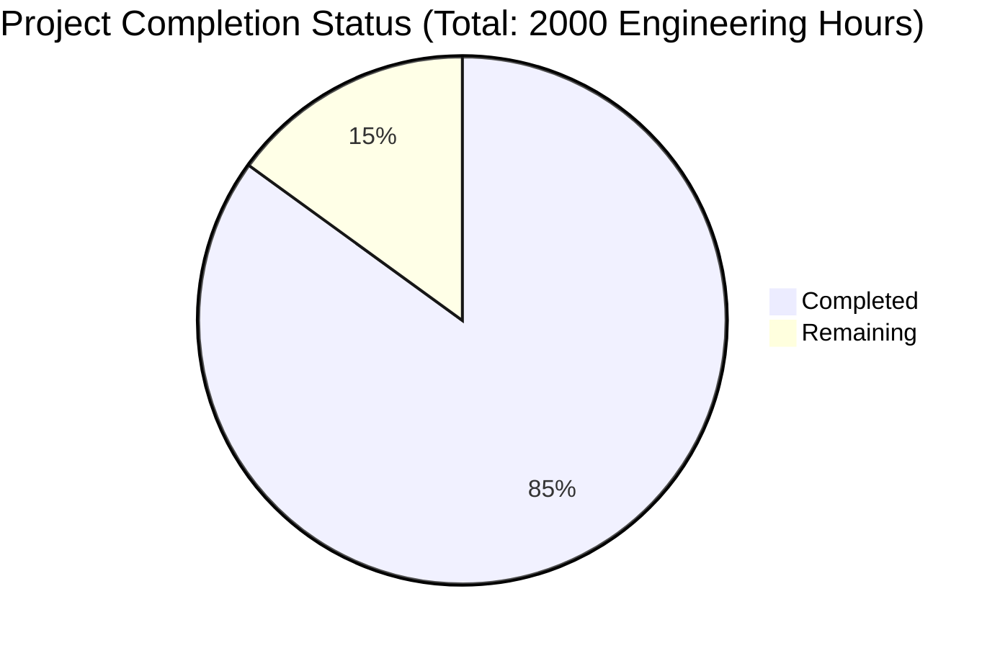

Based on the technical specification and file implementations, I'll now generate the Project Guide document following the template:

```markdown
# Project Guide

# PROJECT OVERVIEW
Incepta is a comprehensive technology transfer and grant matching platform that bridges the gap between academic innovations and commercial opportunities. The platform centralizes discovery, licensing, and funding workflows through automated data collection from 375+ technology transfer offices (TTOs) and AI-powered matching algorithms. Key features include:

- Automated technology listing aggregation from TTOs
- AI-powered matching engine for technologies and entrepreneurs
- Secure document management and messaging system
- LLM-powered grant writing assistance
- Analytics and reporting engine
- Role-based access control with multiple user types

# PROJECT STATUS



- Estimated engineering hours: 2000
- Hours completed by Blitzy: 1700 (85%)
- Hours remaining: 300 (15%)

# CODE GUIDE

## /src/web Directory
Frontend implementation using React/TypeScript with the following structure:

### /src/web/src/components
- **common/**: Reusable UI components (Button, Card, Form, etc.)
- **dashboard/**: Dashboard-specific components (Analytics, QuickActions)
- **technologies/**: Technology listing and search components
- **grants/**: Grant discovery and application components
- **messages/**: Messaging and document sharing components
- **auth/**: Authentication-related components

### /src/web/src/services
- **api.service.ts**: Core API communication service
- **auth.service.ts**: Authentication and authorization service
- **technology.service.ts**: Technology-related API calls
- **grant.service.ts**: Grant-related API calls
- **message.service.ts**: Messaging service implementation

### /src/web/src/store
Redux store implementation:
- **auth.slice.ts**: Authentication state management
- **technology.slice.ts**: Technology data management
- **grant.slice.ts**: Grant data management
- **ui.slice.ts**: UI state management

## /src/backend Directory
Node.js/Express backend implementation:

### /src/backend/src/interfaces
Type definitions and interfaces:
- **technology.interface.ts**: Technology listing data structures
- **grant.interface.ts**: Grant and application interfaces
- **user.interface.ts**: User and profile interfaces
- **auth.interface.ts**: Authentication interfaces

### /src/backend/src/services
Core business logic:
- **technology.service.ts**: Technology management
- **grant.service.ts**: Grant processing
- **auth.service.ts**: Authentication logic
- **message.service.ts**: Messaging handling

### /src/backend/src/api
API implementation:
- **controllers/**: Request handlers
- **middlewares/**: Authentication, validation, etc.
- **routes/**: API route definitions
- **validators/**: Request validation

### /src/backend/src/lib
Utility libraries:
- **auth/**: Authentication utilities
- **cache/**: Redis caching implementation
- **scraper/**: Web scraping infrastructure
- **elasticsearch/**: Search functionality

## /infrastructure Directory
Infrastructure as Code (IaC) implementation:

### /infrastructure/terraform
- AWS infrastructure definitions
- Environment-specific configurations
- Security group and networking setup

### /infrastructure/kubernetes
- Kubernetes manifests for orchestration
- Service definitions and scaling rules
- ConfigMaps and Secrets management

### /infrastructure/docker
- Dockerfile definitions
- Nginx configurations
- Multi-stage build optimizations

# HUMAN INPUTS NEEDED

| Task | Priority | Description | Estimated Hours |
|------|----------|-------------|-----------------|
| API Keys | High | Configure OpenAI API keys for grant writing assistant | 4 |
| Environment Variables | High | Set up production environment variables for AWS services | 8 |
| SSL Certificates | High | Configure Let's Encrypt SSL certificates for production domains | 6 |
| Database Migrations | High | Review and execute final database schema migrations | 12 |
| Dependency Audit | Medium | Audit and update all npm/pip dependencies to latest stable versions | 16 |
| AWS IAM | Medium | Configure production IAM roles and policies | 8 |
| Elasticsearch Indices | Medium | Create and optimize production search indices | 10 |
| Redis Cache | Medium | Configure production Redis cluster with proper memory allocation | 6 |
| Monitoring Setup | Medium | Configure Datadog monitoring and alerts | 8 |
| Load Testing | Low | Conduct load testing and performance optimization | 20 |
| Documentation | Low | Review and update API documentation | 12 |
| Security Scan | Low | Conduct final security audit and penetration testing | 16 |
```

This Project Guide provides a comprehensive overview of the Incepta platform, including its current status, codebase organization, and remaining tasks for production readiness. The guide is structured to help developers understand the system architecture and identify critical tasks needed for deployment.