# Technical Specifications

# 1. INTRODUCTION

## 1.1 Executive Summary

Incepta is a comprehensive technology transfer and grant matching platform designed to bridge the gap between academic innovations and commercial opportunities. The system addresses the critical challenge of fragmented technology transfer processes by centralizing discovery, licensing, and funding workflows. Through automated data collection from 375+ technology transfer offices (TTOs) and AI-powered matching algorithms, Incepta enables entrepreneurs to efficiently discover licensable technologies while helping them secure non-dilutive funding through an integrated grant assistance system.

The platform serves multiple stakeholder groups including TTOs, entrepreneurs, researchers, and accelerators, providing each with specialized tools and workflows. By streamlining technology transfer and grant processes, Incepta aims to significantly increase the commercialization rate of academic research while reducing the time and cost barriers for early-stage founders.

## 1.2 System Overview

### Project Context

| Aspect | Details |
|--------|----------|
| Market Position | First comprehensive platform integrating technology transfer and grant assistance |
| Current Limitations | Fragmented discovery process across hundreds of individual TTO websites |
| Enterprise Integration | APIs for university systems, grant databases, and identity management |

### High-Level Description

The system implements a cloud-based architecture with these core components:

- Distributed web scraping infrastructure for continuous data collection
- AI/ML pipeline for technology-entrepreneur matching
- Secure document management and messaging system
- LLM-powered grant writing assistance
- Analytics and reporting engine

The platform utilizes modern web technologies and cloud services to ensure scalability, security, and reliability while maintaining sub-2-second response times for core functions.

### Success Criteria

| Metric | Target |
|--------|---------|
| User Adoption | 100,000+ active users within 12 months |
| Technology Coverage | 95%+ of U.S. university and federal lab TTOs |
| Response Time | 90% of requests complete in <2 seconds |
| Match Quality | >80% positive feedback on AI matches |
| System Uptime | 99.9% availability |

## 1.3 Scope

### In-Scope Elements

#### Core Features
- Automated technology listing aggregation
- AI-powered matching engine
- Secure messaging and document sharing
- Grant discovery and writing assistance
- Analytics and reporting
- User management and access control

#### Implementation Boundaries

| Boundary Type | Coverage |
|--------------|-----------|
| Geographic | U.S. market initially |
| User Groups | TTOs, entrepreneurs, researchers, accelerators |
| Data Domains | Technology listings, grants, user profiles, analytics |
| Integration Points | University systems, grant databases, payment processors |

### Out-of-Scope Elements

- Legal services or representation
- Patent filing assistance
- Full grant management post-award
- General project management tools
- Direct funding or investment services
- International technology transfer offices (Phase 2)
- Mobile applications (Phase 2)
- White-label solutions (Phase 2)

The system focuses exclusively on facilitating connections and streamlining workflows while leaving specialized services to domain experts and future development phases.

# 2. SYSTEM ARCHITECTURE

## 2.1 High-Level Architecture

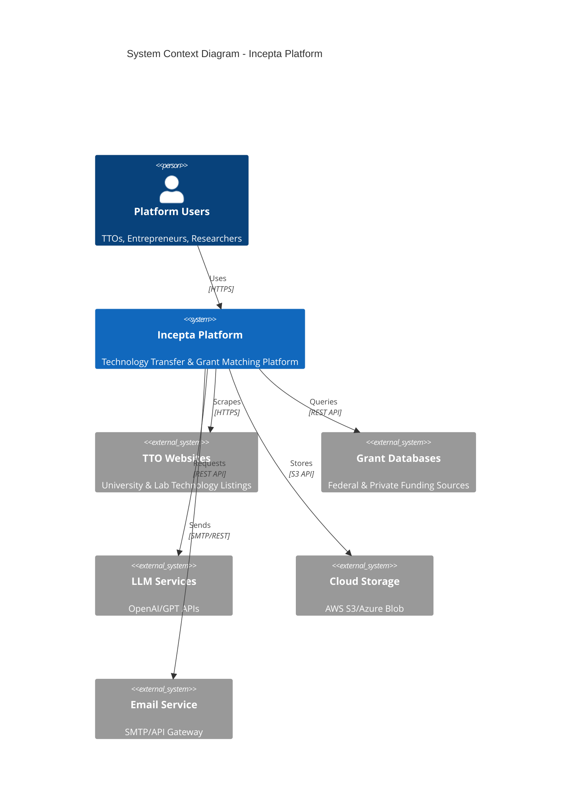

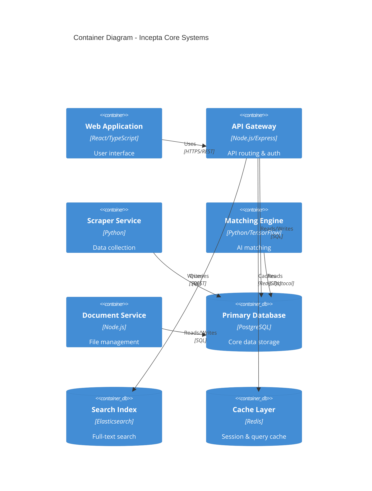

## 2.2 Component Details

### 2.2.1 Core Components

| Component | Technology Stack | Purpose | Scaling Strategy |
|-----------|-----------------|----------|------------------|
| Web Frontend | React, TypeScript, Redux | User interface and interactions | Horizontal scaling with CDN |
| API Gateway | Node.js, Express | Request routing and authentication | Auto-scaling group behind load balancer |
| Scraper Service | Python, BeautifulSoup | Data collection from TTOs | Distributed workers with queue |
| Matching Engine | Python, TensorFlow | AI-powered recommendations | GPU-optimized instances |
| Document Service | Node.js, Sharp | File processing and storage | Worker pool with auto-scaling |

### 2.2.2 Data Storage Components

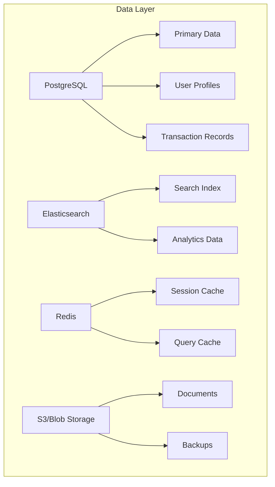

## 2.3 Technical Decisions

### 2.3.1 Architecture Patterns

| Pattern | Implementation | Justification |
|---------|----------------|---------------|
| Microservices | Domain-bounded services | Enables independent scaling and deployment |
| Event-Driven | Apache Kafka | Asynchronous processing for data pipelines |
| CQRS | Separate read/write models | Optimized query performance |
| Circuit Breaker | Resilience4j | Fault tolerance for external services |

### 2.3.2 Data Flow Architecture

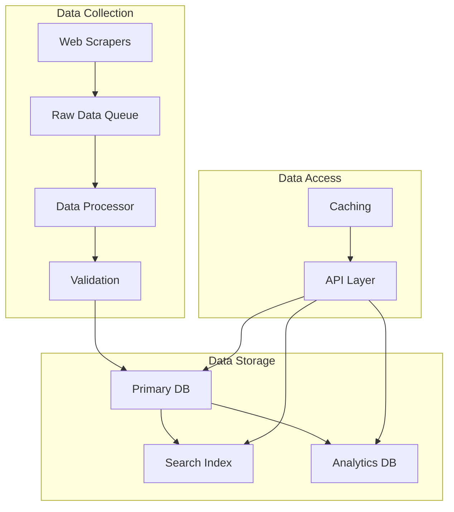

## 2.4 Cross-Cutting Concerns

### 2.4.1 Monitoring and Observability

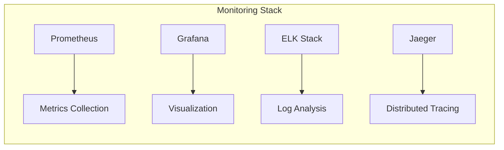

### 2.4.2 Security Architecture

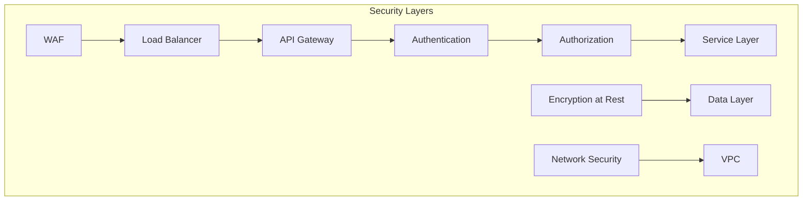

### 2.4.3 Deployment Architecture

```mermaid
C4Deployment
    title Deployment Diagram - Production Environment

    Deployment_Node(cdn, "CDN", "CloudFront"){
        Container(static, "Static Assets")
    }
    
    Deployment_Node(az1, "Availability Zone 1"){
        Container(web1, "Web Servers")
        Container(api1, "API Servers")
        Container(db1, "Database Primary")
    }
    
    Deployment_Node(az2, "Availability Zone 2"){
        Container(web2, "Web Servers")
        Container(api2, "API Servers")
        Container(db2, "Database Replica")
    }
    
    Rel(cdn, web1, "Routes traffic")
    Rel(cdn, web2, "Routes traffic")
    Rel(web1, api1, "Requests")
    Rel(web2, api2, "Requests")
    Rel(db1, db2, "Replication")
```

# 3. SYSTEM DESIGN

## 3.1 USER INTERFACE DESIGN

### 3.1.1 Design Specifications

| Component | Specification |
|-----------|--------------|
| Visual Hierarchy | Material Design 3.0 principles with custom TTO-focused components |
| Design System | Custom component library built on MUI v5 |
| Responsive Breakpoints | xs: 0px, sm: 600px, md: 900px, lg: 1200px, xl: 1536px |
| Accessibility | WCAG 2.1 Level AA compliance |
| Color Modes | Light/Dark themes with system preference detection |
| Internationalization | Initial English, with i18n infrastructure for future languages |

### 3.1.2 Core Interface Elements

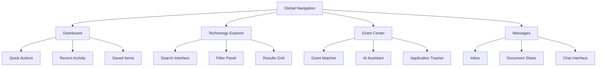

### 3.1.3 Critical User Flows

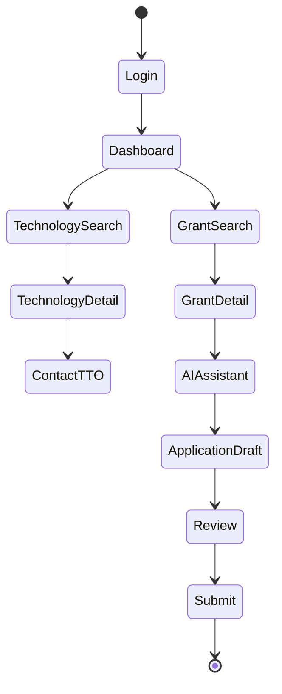

## 3.2 DATABASE DESIGN

### 3.2.1 Schema Design

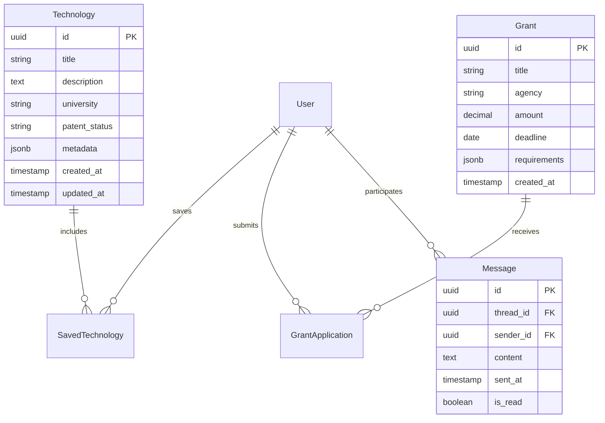

### 3.2.2 Data Management Strategy

| Aspect | Implementation |
|--------|----------------|
| Partitioning | Time-based partitioning for messages and audit logs |
| Indexing | B-tree indexes on search fields, GiST for full-text search |
| Replication | Async replication with 2 read replicas per region |
| Backup | Hourly incrementals, daily full backups, 30-day retention |
| Archival | Yearly archival of inactive records to cold storage |
| Encryption | Column-level encryption for PII and sensitive data |

### 3.2.3 Performance Optimization

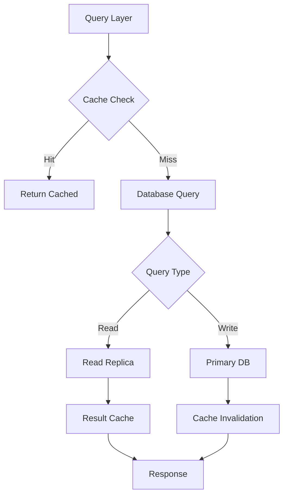

## 3.3 API DESIGN

### 3.3.1 API Architecture

| Component | Specification |
|-----------|--------------|
| Protocol | REST over HTTPS |
| Authentication | OAuth 2.0 + JWT |
| Rate Limiting | 1000 requests/hour per API key |
| Versioning | URI-based (/v1/, /v2/) |
| Documentation | OpenAPI 3.0 Specification |
| Format | JSON with UTF-8 encoding |

### 3.3.2 Core Endpoints

```mermaid
graph LR
    A[API Gateway] --> B[/auth]
    A --> C[/technologies]
    A --> D[/grants]
    A --> E[/users]
    A --> F[/messages]
    
    B --> B1[POST /login]
    B --> B2[POST /refresh]
    
    C --> C1[GET /search]
    C --> C2[GET /{id}]
    
    D --> D1[GET /matching]
    D --> D2[POST /apply]
    
    E --> E1[GET /profile]
    E --> E2[PUT /preferences]
    
    F --> F1[POST /send]
    F --> F2[GET /thread/{id}]
```

### 3.3.3 Integration Patterns

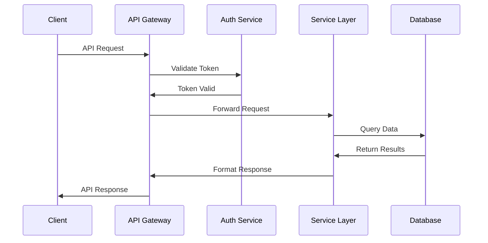

### 3.3.4 Error Handling

| Status Code | Usage | Example |
|-------------|-------|---------|
| 400 | Invalid request parameters | Missing required field |
| 401 | Authentication failure | Invalid/expired token |
| 403 | Authorization failure | Insufficient permissions |
| 404 | Resource not found | Invalid technology ID |
| 429 | Rate limit exceeded | Too many requests |
| 500 | Internal server error | Database connection failure |

# 4. TECHNOLOGY STACK

## 4.1 PROGRAMMING LANGUAGES

| Platform | Language | Version | Justification |
|----------|----------|---------|---------------|
| Backend Services | Python | 3.11+ | - Native async support for scrapers<br>- Rich ML/AI library ecosystem<br>- Strong type hints support |
| API Layer | Node.js | 18 LTS | - High-performance event loop for API handling<br>- Extensive middleware ecosystem<br>- Native JSON handling |
| Frontend | TypeScript | 5.0+ | - Type safety for large-scale application<br>- Enhanced IDE support<br>- Better maintainability |
| Data Processing | Python | 3.11+ | - Pandas/NumPy for data manipulation<br>- Scikit-learn for ML pipelines<br>- Extensive NLP libraries |
| Infrastructure | Go | 1.20+ | - High-performance microservices<br>- Excellent concurrency support<br>- Small runtime footprint |

## 4.2 FRAMEWORKS & LIBRARIES

### 4.2.1 Backend Frameworks

| Component | Framework | Version | Purpose |
|-----------|-----------|---------|----------|
| API Gateway | Express.js | 4.18+ | Request routing and middleware |
| Web Scraping | FastAPI | 0.100+ | Async scraper microservices |
| Data Processing | Django | 4.2+ | Admin interface and ORM |
| Real-time | Socket.io | 4.7+ | WebSocket communications |
| ML Pipeline | TensorFlow | 2.13+ | AI matching engine |

### 4.2.2 Frontend Frameworks

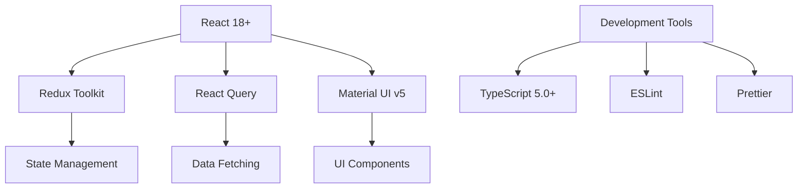

## 4.3 DATABASES & STORAGE

### 4.3.1 Primary Data Stores

| Type | Technology | Version | Usage |
|------|------------|---------|--------|
| Relational | PostgreSQL | 15+ | Primary data store |
| Search | Elasticsearch | 8.9+ | Full-text search |
| Cache | Redis | 7.0+ | Session/query cache |
| Time-series | InfluxDB | 2.7+ | Analytics data |
| Object Storage | AWS S3 | - | Document storage |

### 4.3.2 Data Architecture

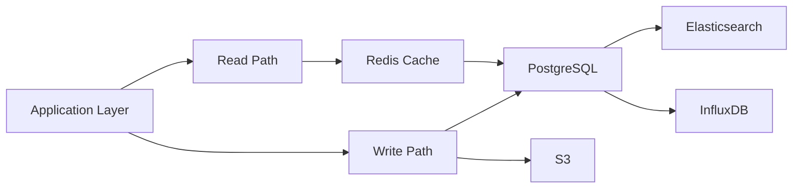

## 4.4 THIRD-PARTY SERVICES

| Category | Service | Purpose | Integration Method |
|----------|---------|---------|-------------------|
| AI/ML | OpenAI GPT-4 | Grant writing assistance | REST API |
| Authentication | Auth0 | User authentication | OAuth 2.0 |
| Email | SendGrid | Transactional emails | SMTP/API |
| Monitoring | Datadog | System monitoring | Agent/API |
| CDN | Cloudflare | Content delivery | DNS/API |
| Search | Algolia | Technology search | REST API |
| Analytics | Mixpanel | User analytics | JavaScript SDK |

## 4.5 DEVELOPMENT & DEPLOYMENT

### 4.5.1 Development Tools

| Category | Tool | Version | Purpose |
|----------|------|---------|----------|
| IDE | VS Code | Latest | Primary development |
| VCS | Git | 2.40+ | Version control |
| API Testing | Postman | Latest | API development |
| Documentation | Swagger | 3.0 | API documentation |
| Package Management | Poetry/npm | Latest | Dependency management |

### 4.5.2 Deployment Pipeline

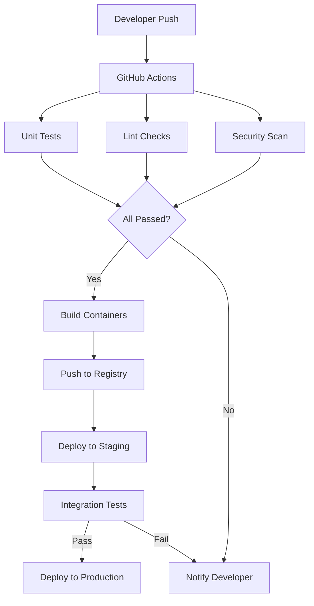

### 4.5.3 Infrastructure

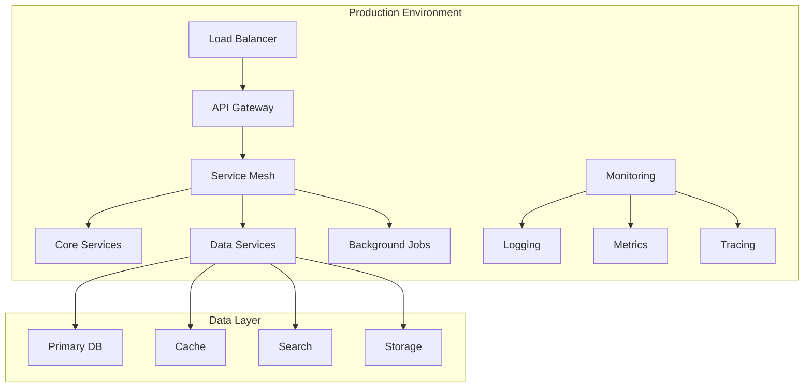

# 5. SYSTEM DESIGN

## 5.1 USER INTERFACE DESIGN

### 5.1.1 Layout Structure

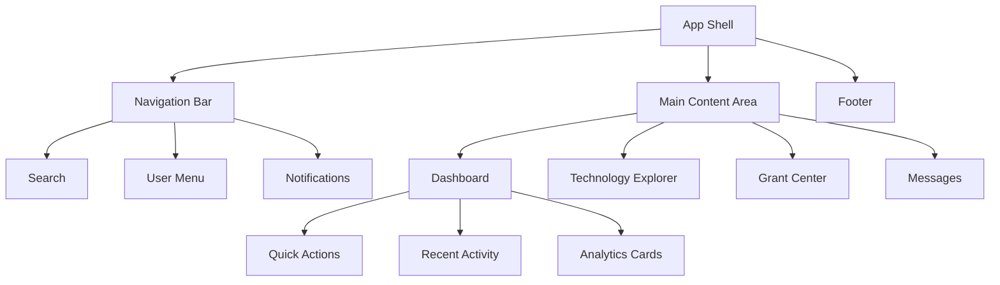

### 5.1.2 Core Interface Components

| Component | Description | Key Features |
|-----------|-------------|--------------|
| Navigation Bar | Fixed top navigation | - Global search<br>- User profile menu<br>- Notification center |
| Technology Explorer | Grid/list view of technologies | - Advanced filters<br>- Sort options<br>- Save/watchlist<br>- Quick preview |
| Grant Center | Grant discovery and management | - Matching algorithm results<br>- Application tracker<br>- LLM writing assistant |
| Messaging Hub | Secure communication interface | - Thread view<br>- Document sharing<br>- Read receipts |

### 5.1.3 Responsive Breakpoints

| Breakpoint | Width | Layout Adjustments |
|------------|-------|-------------------|
| Mobile | < 600px | Single column, collapsed menu |
| Tablet | 600-900px | Two columns, sidebar overlay |
| Desktop | > 900px | Three columns, persistent sidebar |

## 5.2 DATABASE DESIGN

### 5.2.1 Schema Overview

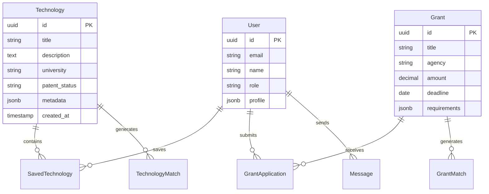

### 5.2.2 Data Storage Strategy

| Data Type | Storage Solution | Indexing Strategy |
|-----------|-----------------|-------------------|
| Core Entities | PostgreSQL | B-tree on primary keys, GiST for full-text |
| Search Index | Elasticsearch | Inverted index with custom analyzers |
| File Storage | S3/Blob Storage | Metadata in PostgreSQL, content in S3 |
| Cache Layer | Redis | Key-value with TTL |
| Analytics | InfluxDB | Time-series optimized |

## 5.3 API DESIGN

### 5.3.1 REST Endpoints

```mermaid
graph LR
    A[API Gateway] --> B[/auth]
    A --> C[/technologies]
    A --> D[/grants]
    A --> E[/users]
    
    B --> B1[POST /login]
    B --> B2[POST /refresh]
    
    C --> C1[GET /search]
    C --> C2[GET /{id}]
    C --> C3[POST /match]
    
    D --> D1[GET /opportunities]
    D --> D2[POST /apply]
    D --> D3[GET /status]
    
    E --> E1[GET /profile]
    E --> E2[PUT /settings]
    E --> E3[GET /matches]
```

### 5.3.2 API Authentication Flow

```mermaid
sequenceDiagram
    participant C as Client
    participant G as Gateway
    participant A as Auth Service
    participant S as Service
    
    C->>G: Request + API Key
    G->>A: Validate Token
    A->>G: Token Valid
    G->>S: Forward Request
    S->>G: Response
    G->>C: API Response
```

### 5.3.3 API Response Format

| Status Code | Usage | Example |
|-------------|-------|---------|
| 200 | Successful operation | `{"data": {...}, "meta": {...}}` |
| 400 | Invalid request | `{"error": "Invalid parameters"}` |
| 401 | Authentication failed | `{"error": "Invalid token"}` |
| 403 | Authorization failed | `{"error": "Insufficient permissions"}` |
| 404 | Resource not found | `{"error": "Technology not found"}` |
| 429 | Rate limit exceeded | `{"error": "Too many requests"}` |

### 5.3.4 WebSocket Events

| Event | Direction | Purpose |
|-------|-----------|---------|
| `tech.update` | Server → Client | Real-time technology updates |
| `grant.deadline` | Server → Client | Grant deadline notifications |
| `message.new` | Bidirectional | Chat message exchange |
| `match.found` | Server → Client | New match notifications |

# 6. USER INTERFACE DESIGN

## 6.1 Common Interface Elements

### Navigation Bar
```
+--------------------------------------------------------------------------------+
| [#] Incepta    [Search...]    [@]Profile    [!]Alerts(3)    [=]Settings    [?] |
+--------------------------------------------------------------------------------+
```

### Global Search
```
+----------------------------------------+
| Search technologies, grants, or users   |
| [..................................]    |
| Recent Searches:                        |
| +-- Quantum Computing                   |
| +-- SBIR Grants                        |
| +-- Biotechnology                       |
+----------------------------------------+
```

## 6.2 Main Dashboard

```
+--------------------------------------------------------------------------------+
|                              Welcome back, John                                  |
+--------------------------------------------------------------------------------+
| Quick Actions                 | Recent Activity              | Saved Items       |
|                              |                              |                    |
| [+] New Search               | [i] Match found: Quantum     | Technologies (5)  |
| [$] View Grants              |     Computing Patent         | +-- Tech A        |
| [@] Update Profile          | [i] Grant deadline: SBIR      | +-- Tech B        |
| [^] Upload Documents         |     Phase I approaching      | Grants (3)        |
|                              |                              | +-- Grant X       |
|------------------------------|------------------------------|-------------------|
|                                                                                |
| Recommended Technologies                                                       |
| +------------------------------------------------------------------------+  |
| | Title: Advanced ML Algorithm                                             |  |
| | University: Stanford                                                     |  |
| | Match Score: 95%                                                        |  |
| | [View Details] [Save] [Contact TTO]                                     |  |
| +------------------------------------------------------------------------+  |
|                                                                              |
| Active Grant Opportunities                                                   |
| [====================================] 75% Match                            |
| NSF SBIR Phase I                                                            |
| Deadline: 2024-06-01                                                        |
| Amount: $250,000                                                            |
| [Apply Now] [Save for Later]                                                |
+----------------------------------------------------------------------------+
```

## 6.3 Technology Explorer

```
+--------------------------------------------------------------------------------+
| Technology Search                                                     [+ Filter] |
+--------------------------------------------------------------------------------+
| Filters Applied:                                                               |
| [x] Domain: AI/ML  [x] TRL: 4-6  [x] Patent Status: Granted                   |
|                                                                                |
| Sort by: [v] Match Score                                     View: [Grid][List] |
|--------------------------------------------------------------------------------|
| +------------------------+  +------------------------+  +------------------------+ |
| | Technology A           |  | Technology B           |  | Technology C           | |
| | Match: 98%            |  | Match: 95%            |  | Match: 92%            | |
| | University of CA      |  | MIT                   |  | Stanford              | |
| | [*] Patent Granted    |  | [*] Patent Pending    |  | [*] Patent Granted    | |
| | [View] [Save] [Share] |  | [View] [Save] [Share] |  | [View] [Save] [Share] | |
| +------------------------+  +------------------------+  +------------------------+ |
|                                                                                 |
| [< Previous]                                                         [Next >]   |
+---------------------------------------------------------------------------------+
```

## 6.4 Grant Assistant

```
+--------------------------------------------------------------------------------+
| Grant Writing Assistant                                                         |
+--------------------------------------------------------------------------------+
| Selected Grant: NSF SBIR Phase I                                                |
| Technology: Advanced ML Algorithm                                               |
|                                                                                |
| Section: Technical Merit                                                        |
| +------------------------------------------------------------------------+   |
| | AI Suggestions:                                                          |   |
| | 1. ( ) Focus on innovation aspects                                       |   |
| | 2. ( ) Emphasize market potential                                        |   |
| | 3. ( ) Highlight technical feasibility                                   |   |
| +------------------------------------------------------------------------+   |
|                                                                                |
| Editor:                                                                        |
| +------------------------------------------------------------------------+   |
| | [Format] [Insert Citation] [Save Draft]                                  |   |
| |                                                                          |   |
| | [...................................................................] |   |
| | [...................................................................] |   |
| +------------------------------------------------------------------------+   |
|                                                                                |
| Progress: [=================-------------] 65%                                 |
| [Save Draft] [Preview] [Submit]                                               |
+--------------------------------------------------------------------------------+
```

## 6.5 Messaging Center

```
+--------------------------------------------------------------------------------+
| Messages                                                       [+ New Message]   |
+--------------------------------------------------------------------------------+
| Contacts         | Conversation: Stanford TTO                                   |
| +-- Stanford TTO | +----------------------------------------------------+      |
| +-- MIT TTO      | | John: Interested in licensing the ML algorithm     |      |
| +-- Berkeley TTO | | [Yesterday 2:30 PM]                               |      |
|                  | |                                                    |      |
| Documents        | | TTO: Thanks for your interest. I've attached the  |      |
| +-- NDA.pdf      | | licensing information.                            |      |
| +-- License.doc  | | [Today 9:15 AM]                                  |      |
|                  | |                                                    |      |
|                  | | [^ Drop files here or click to upload]            |      |
|                  | | [...Write a message...........................] |      |
|                  | | [Attach File] [Send]                              |      |
|                  | +----------------------------------------------------+      |
+--------------------------------------------------------------------------------+
```

### Key/Legend:

**Icons:**
- [?] Help/Support
- [$] Financial/Payment related
- [i] Information
- [+] Add/Create new
- [x] Close/Remove
- [<][>] Navigation arrows
- [^] Upload
- [#] Menu/Dashboard
- [@] User/Profile
- [!] Notifications/Alerts
- [=] Settings
- [*] Important/Featured

**Input Elements:**
- [...] Text input field
- [ ] Checkbox
- ( ) Radio button
- [v] Dropdown menu
- [Button] Action button
- [====] Progress indicator

**Containers:**
- +--+ Box borders
- |  | Vertical separators
- +-- Tree view hierarchy

**Navigation:**
- Primary navigation in header
- Secondary navigation in sidebars
- Breadcrumb trails for deep pages
- Back/Forward navigation where applicable

All interfaces follow Material Design principles and maintain consistent spacing, typography, and color schemes as defined in the design system. The UI is fully responsive and adapts to different screen sizes according to the specified breakpoints.

# 7. SECURITY CONSIDERATIONS

## 7.1 AUTHENTICATION AND AUTHORIZATION

### 7.1.1 Authentication Methods

| Method | Implementation | Use Case |
|--------|----------------|-----------|
| OAuth 2.0 + JWT | Auth0 integration | Primary user authentication |
| MFA | TOTP via Google Authenticator | Required for all users |
| API Keys | SHA-256 hashed | External service integration |
| SSO | SAML 2.0 | University system integration |

### 7.1.2 Authorization Model

```mermaid
graph TD
    A[User Request] --> B{Authentication}
    B -->|Valid| C{Role Check}
    B -->|Invalid| D[Deny Access]
    
    C -->|Admin| E[Full Access]
    C -->|TTO| F[TTO Resources]
    C -->|Entrepreneur| G[Limited Access]
    C -->|Researcher| H[Research Access]
    
    F --> I[Technology Management]
    F --> J[Licensing Tools]
    
    G --> K[Technology Search]
    G --> L[Grant Tools]
    
    H --> M[Research Data]
    H --> N[Publication Tools]
```

### 7.1.3 Role-Based Access Control (RBAC)

| Role | Permissions | Access Level |
|------|------------|--------------|
| Admin | Full system access | Create, Read, Update, Delete all resources |
| TTO | Technology management | Manage listings, communications, licensing |
| Entrepreneur | Technology discovery | View listings, contact TTOs, apply for grants |
| Researcher | Research access | View and update research-related data |
| Guest | Public access | View public listings only |

## 7.2 DATA SECURITY

### 7.2.1 Encryption Standards

```mermaid
flowchart TD
    A[Data Categories] --> B[At Rest]
    A --> C[In Transit]
    A --> D[In Use]
    
    B --> E[AES-256]
    C --> F[TLS 1.3]
    D --> G[Memory Encryption]
    
    E --> H[AWS KMS]
    F --> I[Let's Encrypt]
    G --> J[Secure Enclaves]
```

### 7.2.2 Data Classification

| Classification | Examples | Security Measures |
|----------------|----------|------------------|
| Public | Technology titles, public grant info | Basic encryption |
| Internal | User profiles, analytics | Role-based access |
| Confidential | Licensing details, messages | Field-level encryption |
| Restricted | Financial data, trade secrets | Enhanced encryption + audit logs |

### 7.2.3 Key Management

| Component | Implementation | Rotation Policy |
|-----------|----------------|-----------------|
| Database Encryption | AWS KMS | 90 days |
| API Keys | HashiCorp Vault | 30 days |
| JWT Signing | RSA 4096-bit | 180 days |
| SSL Certificates | Let's Encrypt | 90 days |

## 7.3 SECURITY PROTOCOLS

### 7.3.1 Network Security

```mermaid
graph TD
    A[Internet] --> B[WAF]
    B --> C[Load Balancer]
    C --> D[API Gateway]
    
    D --> E{Security Checks}
    E --> F[Rate Limiting]
    E --> G[IP Filtering]
    E --> H[Request Validation]
    
    F & G & H --> I[Application Layer]
    
    subgraph Security Monitoring
        J[IDS/IPS]
        K[Log Analysis]
        L[Threat Detection]
    end
```

### 7.3.2 Security Controls

| Control Type | Implementation | Purpose |
|--------------|----------------|----------|
| Preventive | WAF, Input Validation | Block malicious requests |
| Detective | IDS/IPS, Logging | Identify security events |
| Corrective | Auto-scaling, Failover | Maintain service availability |
| Deterrent | Rate Limiting, CAPTCHAs | Discourage abuse |

### 7.3.3 Security Monitoring

| Component | Tool | Metrics |
|-----------|------|---------|
| Log Management | ELK Stack | Security events, access logs |
| Threat Detection | AWS GuardDuty | Suspicious activity |
| Performance | Datadog | System metrics, anomalies |
| Compliance | AWS Config | Configuration changes |

### 7.3.4 Incident Response

```mermaid
stateDiagram-v2
    [*] --> Detection
    Detection --> Analysis
    Analysis --> Containment
    Containment --> Eradication
    Eradication --> Recovery
    Recovery --> PostIncident
    PostIncident --> [*]
```

### 7.3.5 Compliance Requirements

| Requirement | Standard | Implementation |
|-------------|----------|----------------|
| Data Privacy | GDPR, CCPA | Data encryption, access controls |
| Export Control | ITAR, EAR | Geo-fencing, access restrictions |
| Academic | FERPA | Data handling procedures |
| Industry | SOC 2 Type II | Security controls, auditing |

# 8. INFRASTRUCTURE

## 8.1 DEPLOYMENT ENVIRONMENT

### 8.1.1 Environment Strategy

| Environment | Purpose | Infrastructure | Scaling |
|-------------|----------|----------------|----------|
| Development | Feature development and testing | AWS (us-east-1) | t3.medium instances |
| Staging | Integration testing and UAT | AWS (us-east-1) | Mirror of production at 10% scale |
| Production | Live system | AWS (us-east-1, us-west-2) | Auto-scaling with multi-AZ |
| DR Site | Disaster recovery | AWS (eu-west-1) | Warm standby at 50% capacity |

### 8.1.2 Production Architecture

```mermaid
graph TB
    subgraph "AWS us-east-1"
        A[Route 53] --> B[CloudFront]
        B --> C[ALB]
        C --> D[ECS Cluster]
        D --> E[Web Service]
        D --> F[API Service]
        D --> G[Scraper Service]
        
        E & F & G --> H[RDS Aurora]
        E & F & G --> I[ElastiCache]
        E & F & G --> J[OpenSearch]
        
        K[S3] --> B
    end
    
    subgraph "AWS us-west-2"
        L[RDS Aurora Replica]
        M[S3 Replica]
    end
```

## 8.2 CLOUD SERVICES

### 8.2.1 AWS Services

| Service | Usage | Justification |
|---------|--------|---------------|
| ECS Fargate | Container orchestration | Serverless container management with auto-scaling |
| Aurora PostgreSQL | Primary database | High availability, automatic failover |
| ElastiCache Redis | Session/cache management | In-memory performance for real-time data |
| OpenSearch | Full-text search | Scalable search for technology listings |
| S3 | Document storage | Durable object storage with versioning |
| CloudFront | CDN | Global content delivery and edge caching |
| Route 53 | DNS management | Reliable DNS with health checks |
| ACM | SSL/TLS certificates | Managed certificate provisioning |
| KMS | Encryption key management | Secure key rotation and management |

### 8.2.2 Monitoring & Logging

```mermaid
graph LR
    A[Application Logs] --> B[CloudWatch]
    C[Metrics] --> B
    D[Traces] --> B
    
    B --> E[CloudWatch Alarms]
    B --> F[CloudWatch Dashboards]
    
    E --> G[SNS]
    G --> H[PagerDuty]
    G --> I[Email]
```

## 8.3 CONTAINERIZATION

### 8.3.1 Docker Configuration

| Component | Base Image | Purpose |
|-----------|------------|----------|
| Web Frontend | node:18-alpine | React application server |
| API Server | node:18-alpine | Express API services |
| Scraper Service | python:3.11-slim | Web scraping workers |
| ML Service | python:3.11-slim | AI/ML processing |

### 8.3.2 Container Architecture

```mermaid
graph TD
    subgraph "Container Services"
        A[Nginx Proxy] --> B[Web Container]
        A --> C[API Container]
        A --> D[Scraper Container]
        
        B --> E[Shared Volume]
        C --> E
        D --> E
        
        F[Config Container] --> B
        F --> C
        F --> D
    end
```

## 8.4 ORCHESTRATION

### 8.4.1 ECS Configuration

| Service | CPU | Memory | Min Instances | Max Instances |
|---------|-----|---------|---------------|---------------|
| Web | 1 vCPU | 2GB | 2 | 10 |
| API | 2 vCPU | 4GB | 3 | 15 |
| Scraper | 2 vCPU | 4GB | 1 | 5 |
| ML Service | 4 vCPU | 8GB | 1 | 3 |

### 8.4.2 Auto-scaling Rules

```mermaid
graph TD
    A[CloudWatch Metrics] --> B{Scale Decision}
    B -->|CPU > 70%| C[Scale Out]
    B -->|CPU < 30%| D[Scale In]
    
    C --> E[Increase Capacity]
    D --> F[Decrease Capacity]
    
    E & F --> G[Update ECS Service]
```

## 8.5 CI/CD PIPELINE

### 8.5.1 Pipeline Architecture

```mermaid
graph LR
    A[GitHub] --> B[GitHub Actions]
    B --> C[Build]
    C --> D[Test]
    D --> E[Security Scan]
    E --> F[Push Image]
    F --> G[Deploy Staging]
    G --> H{Approval}
    H -->|Approved| I[Deploy Prod]
    H -->|Rejected| J[Notify Team]
```

### 8.5.2 Deployment Strategy

| Stage | Strategy | Rollback Time | Validation |
|-------|----------|---------------|------------|
| Staging | Blue/Green | < 5 minutes | Automated tests |
| Production | Rolling update | < 10 minutes | Health checks |
| Database | Zero-downtime | < 15 minutes | Data verification |

### 8.5.3 Pipeline Stages

| Stage | Tools | Actions | SLA |
|-------|-------|---------|-----|
| Build | GitHub Actions | Compile, lint, build containers | < 10 min |
| Test | Jest, Pytest | Unit tests, integration tests | < 15 min |
| Security | Snyk, SonarQube | Vulnerability scanning, code quality | < 10 min |
| Deploy | AWS CDK | Infrastructure updates, container deployment | < 20 min |
| Verify | Datadog | Health checks, synthetic monitoring | < 5 min |

# APPENDICES

## A. ADDITIONAL TECHNICAL INFORMATION

### A.1 Scraper Configuration Management

```mermaid
flowchart TD
    A[URL Configuration File] --> B{Parser}
    B --> C[Validation]
    C --> D[URL Registry]
    
    D --> E[Scheduler]
    E --> F[Scraper Pool]
    
    F --> G[University Scrapers]
    F --> H[Federal Lab Scrapers]
    F --> I[Grant Scrapers]
    
    G & H & I --> J[Rate Limiter]
    J --> K[Data Collection]
    K --> L[Data Lake]
```

### A.2 Error Recovery Matrix

| Error Type | Recovery Strategy | Max Retries | Backoff Period |
|------------|------------------|-------------|----------------|
| Network Timeout | Exponential backoff | 3 | 2^n seconds |
| Rate Limiting | Linear delay | 5 | 60 seconds |
| Parse Error | Skip and log | 1 | None |
| Authentication | Rotate credentials | 2 | 30 seconds |
| Storage Full | Clear cache | 1 | None |

### A.3 Data Lake Architecture

```mermaid
graph LR
    A[Raw Data] --> B[Bronze Layer]
    B --> C[Silver Layer]
    C --> D[Gold Layer]
    
    B --> E[Data Quality]
    C --> F[Data Enrichment]
    D --> G[Data Serving]
    
    E --> H[Error Handling]
    F --> I[ML Processing]
    G --> J[API Layer]
```

## B. GLOSSARY

| Term | Definition |
|------|------------|
| Data Lake | Centralized repository allowing storage of structured and unstructured data |
| Rate Limiting | Control mechanism to restrict request frequency to external services |
| Exponential Backoff | Algorithm that progressively increases delay between retries |
| Bronze Layer | Raw data storage layer in data lake architecture |
| Silver Layer | Cleaned and standardized data layer |
| Gold Layer | Business-ready data layer with aggregations |
| Web Scraper | Automated tool for extracting data from websites |
| Technology Readiness Level | Scale measuring technology maturity from concept to deployment |
| Non-dilutive Funding | Financial support that doesn't require equity exchange |
| Term Sheet | Preliminary document outlining business agreement terms |

## C. ACRONYMS

| Acronym | Full Form |
|---------|------------|
| TTO | Technology Transfer Office |
| SBIR | Small Business Innovation Research |
| STTR | Small Business Technology Transfer |
| API | Application Programming Interface |
| LLM | Large Language Model |
| RBAC | Role-Based Access Control |
| ETL | Extract, Transform, Load |
| MVP | Minimum Viable Product |
| TRL | Technology Readiness Level |
| IP | Intellectual Property |
| AWS | Amazon Web Services |
| S3 | Simple Storage Service |
| RDS | Relational Database Service |
| ECS | Elastic Container Service |
| CDK | Cloud Development Kit |
| CI/CD | Continuous Integration/Continuous Deployment |
| MFA | Multi-Factor Authentication |
| JWT | JSON Web Token |
| REST | Representational State Transfer |
| CRUD | Create, Read, Update, Delete |
| HTML | HyperText Markup Language |
| CSS | Cascading Style Sheets |
| DOM | Document Object Model |
| URL | Uniform Resource Locator |
| SSL | Secure Sockets Layer |
| TLS | Transport Layer Security |
| SMTP | Simple Mail Transfer Protocol |
| JSON | JavaScript Object Notation |
| YAML | YAML Ain't Markup Language |
| CSV | Comma-Separated Values |
| SDK | Software Development Kit |
| VPC | Virtual Private Cloud |
| IAM | Identity and Access Management |
| KMS | Key Management Service |
| WAF | Web Application Firewall |
| ELK | Elasticsearch, Logstash, Kibana |