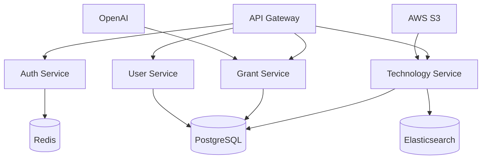

# Incepta Backend Service

[](https://github.com/incepta/backend/actions)
[](https://coveralls.io/github/incepta/backend)
[](https://opensource.org/licenses/MIT)
[](https://nodejs.org)
[](https://www.docker.com/)

## Project Overview

Incepta's backend service powers the comprehensive technology transfer and grant matching platform. Built on a modern microservices architecture, it provides robust APIs for technology discovery, licensing workflows, and grant assistance.

### Architecture Overview



### Core Features
- RESTful API Gateway with OAuth 2.0 + JWT authentication
- Real-time technology listing aggregation
- AI-powered matching engine
- Secure document management
- Grant discovery and assistance
- Analytics and reporting engine

### Technology Stack
- Node.js 18 LTS
- Express.js 4.18+
- PostgreSQL 15
- Redis 7.0
- Elasticsearch 8.9
- Docker & Docker Compose
- AWS Services (S3, CloudFront, RDS)

## Prerequisites

- Node.js >= 18.0.0
- Docker >= 20.10.0
- Docker Compose >= 2.0.0
- PostgreSQL 15
- Redis 7.0
- Elasticsearch 8.9
- OpenAI API key
- AWS account credentials

## Getting Started

### Clone and Install

```bash
git clone https://github.com/incepta/backend.git
cd src/backend
npm install
cp .env.example .env
npm run setup:dev
```

### Docker Environment Setup

```bash
# Build and start services
docker-compose build
docker-compose up -d

# Verify services
docker-compose ps

# Monitor logs
docker-compose logs -f
```

### Development Workflow

```bash
# Start development server
npm run dev

# Run tests
npm run test
npm run test:coverage

# Lint code
npm run lint

# Build for production
npm run build

# Database migrations
npm run db:migrate
```

## Development

### Project Structure
```
src/backend/
├── config/               # Configuration files
├── src/
│   ├── api/             # API routes and controllers
│   ├── services/        # Business logic services
│   ├── models/          # Database models
│   ├── middleware/      # Custom middleware
│   ├── utils/           # Utility functions
│   └── validators/      # Request validators
├── tests/               # Test suites
├── docs/                # Additional documentation
└── scripts/             # Utility scripts
```

### Available Scripts
- `npm run dev`: Start development server with hot reload
- `npm run build`: Build for production
- `npm run start`: Start production server
- `npm run test`: Run test suite
- `npm run lint`: Run ESLint
- `npm run format`: Format code with Prettier
- `npm run db:migrate`: Run database migrations
- `npm run db:seed`: Seed database with initial data

### Code Style Guide
- ESLint configuration with Airbnb style guide
- Prettier for consistent formatting
- TypeScript strict mode enabled
- JSDoc comments required for public APIs
- Unit test coverage minimum: 80%

## API Documentation

### Authentication
- OAuth 2.0 + JWT implementation
- Refresh token rotation
- Rate limiting per API key
- MFA support for sensitive operations

### Core Endpoints

#### Authentication
- `POST /api/v1/auth/login`
- `POST /api/v1/auth/refresh`
- `POST /api/v1/auth/logout`

#### Technologies
- `GET /api/v1/technologies`
- `GET /api/v1/technologies/:id`
- `POST /api/v1/technologies/search`
- `POST /api/v1/technologies/match`

#### Grants
- `GET /api/v1/grants`
- `GET /api/v1/grants/:id`
- `POST /api/v1/grants/apply`
- `GET /api/v1/grants/recommendations`

#### Users
- `GET /api/v1/users/profile`
- `PUT /api/v1/users/profile`
- `GET /api/v1/users/matches`
- `POST /api/v1/users/preferences`

### Error Handling
```javascript
{
  "status": 400,
  "error": "Bad Request",
  "message": "Invalid parameters",
  "details": [...],
  "requestId": "uuid"
}
```

## Security

### Authentication Implementation
- JWT with RS256 signing
- Token rotation every 15 minutes
- Refresh tokens with sliding expiration
- Rate limiting by IP and API key

### Authorization
- Role-based access control (RBAC)
- Resource-level permissions
- API key scoping
- IP whitelist support

### Data Security
- AES-256 encryption at rest
- TLS 1.3 in transit
- Field-level encryption for PII
- Audit logging for sensitive operations

## Deployment

### Environment Configuration
- Development: Local Docker environment
- Staging: AWS ECS with blue/green deployment
- Production: AWS ECS with zero-downtime updates
- DR: Multi-region failover capability

### Build Process
1. Static code analysis
2. Unit tests
3. Integration tests
4. Docker image build
5. Vulnerability scan
6. Push to registry

### Monitoring
- Health check endpoints
- Prometheus metrics
- ELK stack for logs
- Datadog integration
- Custom dashboard templates

### Performance
- Response time SLA: < 200ms
- Rate limiting: 1000 req/min per API key
- Cache hit ratio target: > 80%
- Automatic scaling triggers

## Contributing

1. Fork the repository
2. Create feature branch (`git checkout -b feature/amazing-feature`)
3. Commit changes (`git commit -m 'Add amazing feature'`)
4. Push to branch (`git push origin feature/amazing-feature`)
5. Open pull request

## License

This project is licensed under the MIT License - see the [LICENSE](LICENSE) file for details.